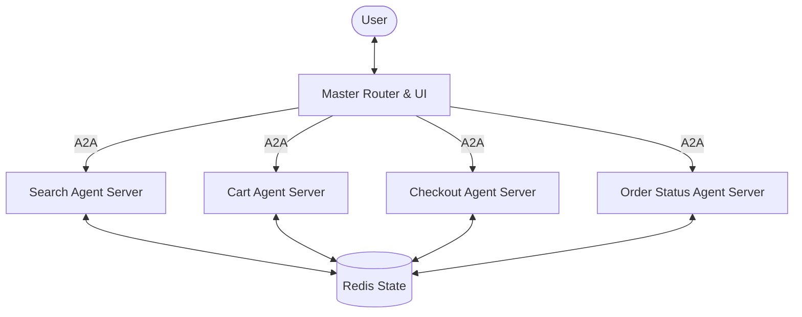

# Distributed Multi-Agent eCommerce System (A2A)

This project implements a distributed agent architecture using the **Agent2Agent (A2A)** protocol. Each agent runs as a separate service in a Docker container, communicating via HTTP while sharing state through a central Redis database.

## Architecture



## Services

| Service | Port | Description |
|---------|------|-------------|
| `master-router` | 7860 | Gradio UI & Request Coordinator (A2A Client) |
| `search-agent` | 8000 | Product Discovery (A2A Server) |
| `cart-agent` | 8000 | Cart Operations (A2A Server) |
| `checkout-agent` | 8000 | Order Processing (A2A Server) |
| `order-agent` | 8000 | Status Tracking (A2A Server) |
| `redis` | 6379 | Shared state for carts and orders |

## Setup & Running

1. **Requirements**: 
   - Docker & Docker Compose
   - Python 3.10+ (for local development)

2. **Start the system**:
   ```bash
   docker-compose up --build
   ```

3. **Access the UI**:
   Open `http://localhost:7860` in your browser.

## Logic Implementation
The system uses the `a2a-sdk` to handle protocol-compliant message passing. Each remote agent serves an `AgentCard` and implements an `AgentExecutor` to process tasks. State is persisted in Redis, allowing agents to maintain context across the distributed environment.
